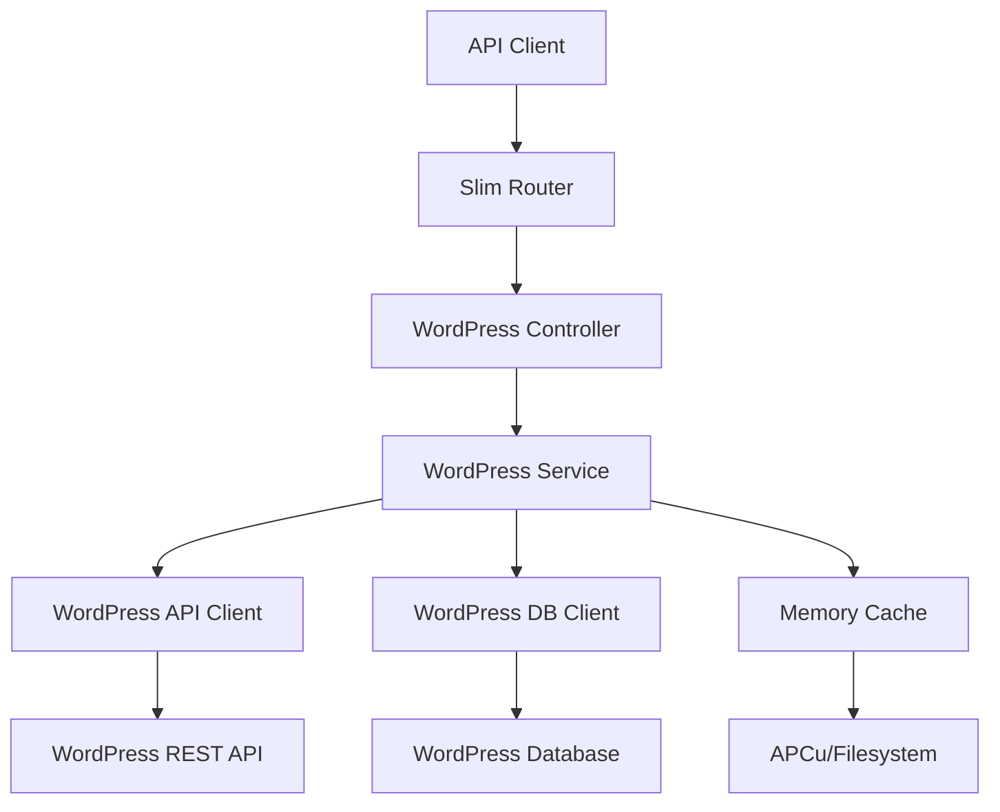

# WordPress API Integration Design Document

## Overview

This design integrates WordPress REST API and direct database access capabilities into the existing PHP Slim framework application. The integration will provide a unified interface for accessing WordPress content, users, and metadata while maintaining the existing architecture patterns including caching, error handling, and RESTful API design.

The solution supports both WordPress REST API calls and direct database access, with intelligent fallback mechanisms and comprehensive caching to optimize performance.

## Architecture

### High-Level Architecture



### Integration Points

1. **Configuration Layer**: Environment-based configuration for WordPress connections
2. **Service Layer**: WordPress-specific business logic and data transformation
3. **Client Layer**: HTTP client for WordPress REST API and database connection management
4. **Controller Layer**: RESTful endpoints following existing patterns
5. **Caching Layer**: Extends existing MemoryCache for WordPress-specific caching strategies

## Components and Interfaces

### 1. WordPress Configuration Manager

**Location**: `src/WordPress/Config/WordPressConfig.php`

```php
interface WordPressConfigInterface
{
    public function getApiEndpoint(): string;
    public function getApiCredentials(): array;
    public function getDatabaseConfig(): array;
    public function isApiEnabled(): bool;
    public function isDatabaseEnabled(): bool;
    public function getCacheSettings(): array;
}
```

**Responsibilities**:
- Load WordPress configuration from environment variables
- Validate connection settings
- Provide fallback configurations
- Support multiple WordPress site configurations

### 2. WordPress API Client

**Location**: `src/WordPress/Clients/WordPressApiClient.php`

```php
interface WordPressApiClientInterface
{
    public function getPosts(array $params = []): array;
    public function getPost(int $id): ?array;
    public function getUsers(array $params = []): array;
    public function getUser(int $id): ?array;
    public function getTaxonomies(): array;
    public function getCategories(array $params = []): array;
    public function getTags(array $params = []): array;
    public function authenticate(string $username, string $password): ?array;
}
```

**Responsibilities**:
- HTTP client wrapper for WordPress REST API
- Authentication handling (JWT, Application Passwords, Basic Auth)
- Request/response transformation
- Rate limiting and retry logic
- Error handling and logging

### 3. WordPress Database Client

**Location**: `src/WordPress/Clients/WordPressDatabaseClient.php`

```php
interface WordPressDatabaseClientInterface
{
    public function getPosts(array $criteria = []): array;
    public function getPost(int $id): ?array;
    public function getUsers(array $criteria = []): array;
    public function getUser(int $id): ?array;
    public function getPostMeta(int $postId, string $key = null): array;
    public function getUserMeta(int $userId, string $key = null): array;
    public function getTerms(string $taxonomy, array $criteria = []): array;
}
```

**Responsibilities**:
- Direct WordPress database queries
- WordPress table prefix handling
- Complex query operations not available via REST API
- Relationship handling (posts, users, taxonomies, meta)
- Connection management and pooling

### 4. WordPress Service Layer

**Location**: `src/WordPress/Services/WordPressService.php`

```php
interface WordPressServiceInterface
{
    public function getPosts(array $filters = []): array;
    public function getPost($identifier): ?array;
    public function getUsers(array $filters = []): array;
    public function getUser($identifier): ?array;
    public function searchContent(string $query, array $options = []): array;
    public function getTaxonomyData(string $taxonomy = null): array;
    public function authenticateUser(string $username, string $password): ?array;
}
```

**Responsibilities**:
- Business logic orchestration
- Data source selection (API vs Database)
- Fallback mechanism implementation
- Data transformation and normalization
- Cache management integration

### 5. WordPress Controller

**Location**: `src/Controllers/WordPressController.php`

**Endpoints**:
- `GET /wordpress/posts` - List WordPress posts with filtering
- `GET /wordpress/posts/{id}` - Get specific WordPress post
- `GET /wordpress/users` - List WordPress users
- `GET /wordpress/users/{id}` - Get specific WordPress user
- `GET /wordpress/taxonomies` - Get taxonomy information
- `GET /wordpress/categories` - List categories
- `GET /wordpress/tags` - List tags
- `POST /wordpress/auth` - Authenticate WordPress user
- `GET /wordpress/search` - Search WordPress content

**Responsibilities**:
- HTTP request/response handling
- Parameter validation and sanitization
- Authentication and authorization
- Error response formatting
- OpenAPI documentation

## Data Models

### WordPress Post Model

```php
class WordPressPost
{
    public int $id;
    public string $title;
    public string $content;
    public string $excerpt;
    public string $status;
    public string $type;
    public DateTime $date;
    public DateTime $modified;
    public string $slug;
    public array $categories;
    public array $tags;
    public array $meta;
    public WordPressUser $author;
    public string $featuredImage;
}
```

### WordPress User Model

```php
class WordPressUser
{
    public int $id;
    public string $username;
    public string $email;
    public string $displayName;
    public string $firstName;
    public string $lastName;
    public array $roles;
    public array $capabilities;
    public array $meta;
    public DateTime $registered;
    public string $avatarUrl;
}
```

### WordPress Taxonomy Model

```php
class WordPressTaxonomy
{
    public int $id;
    public string $name;
    public string $slug;
    public string $description;
    public int $count;
    public ?int $parent;
    public array $children;
    public array $meta;
}
```

## Error Handling

### Error Categories

1. **Configuration Errors**: Invalid WordPress settings, missing credentials
2. **Connection Errors**: Network issues, unreachable WordPress installations
3. **Authentication Errors**: Invalid credentials, expired tokens
4. **API Errors**: WordPress REST API specific errors, rate limiting
5. **Database Errors**: Connection failures, query errors, permission issues
6. **Data Errors**: Invalid data formats, missing required fields

### Error Response Format

```php
{
    "success": false,
    "error": {
        "code": "WP_CONNECTION_FAILED",
        "message": "Unable to connect to WordPress API",
        "details": {
            "endpoint": "https://example.com/wp-json/wp/v2/",
            "http_code": 404,
            "wordpress_error": "rest_no_route"
        }
    },
    "fallback_used": true
}
```

### Fallback Strategies

1. **API to Database**: When REST API fails, attempt direct database access
2. **Database to API**: When database is unavailable, use REST API
3. **Cached Data**: Serve stale cache data when both sources fail
4. **Graceful Degradation**: Return partial data with warnings

## Testing Strategy

### Unit Tests

**Location**: `tests/Unit/WordPress/`

- **Configuration Tests**: Validate environment loading and validation
- **Client Tests**: Mock HTTP responses and database queries
- **Service Tests**: Business logic and fallback mechanisms
- **Model Tests**: Data transformation and validation

### Integration Tests

**Location**: `tests/Integration/WordPress/`

- **API Integration**: Real WordPress REST API calls (test environment)
- **Database Integration**: WordPress database operations
- **Cache Integration**: Cache behavior with WordPress data
- **Controller Integration**: Full HTTP request/response cycles

### Test Data Management

- **WordPress Test Site**: Dedicated WordPress installation for testing
- **Database Fixtures**: Sample WordPress data for consistent testing
- **Mock Responses**: Cached API responses for offline testing
- **Test Configuration**: Separate environment variables for testing

### Performance Tests

- **Cache Effectiveness**: Measure cache hit rates and performance gains
- **Fallback Performance**: Test fallback mechanism response times
- **Concurrent Access**: Multiple simultaneous WordPress requests
- **Large Dataset Handling**: Performance with large WordPress installations

## Caching Strategy

### Cache Keys Structure

```
wp:{site_id}:{resource_type}:{identifier}:{params_hash}
```

Examples:
- `wp:main:posts:list:a1b2c3d4` - Posts list with specific parameters
- `wp:main:post:123:full` - Full post data for ID 123
- `wp:main:user:456:profile` - User profile for ID 456
- `wp:main:taxonomies:categories:all` - All categories

### Cache Invalidation

1. **Time-based**: TTL for different content types
   - Posts: 1 hour (frequently updated)
   - Users: 4 hours (less frequent updates)
   - Taxonomies: 24 hours (rarely change)

2. **Event-based**: Invalidate on WordPress webhooks (if available)
   - Post updates trigger cache invalidation
   - User changes clear user cache
   - Taxonomy modifications clear taxonomy cache

3. **Manual**: Admin endpoints for cache management
   - Clear specific WordPress site cache
   - Clear specific content type cache
   - Full WordPress cache flush

### Cache Warming

- **Background Jobs**: Pre-populate frequently accessed data
- **Predictive Caching**: Cache related content when accessing posts
- **Lazy Loading**: Cache data on first access with extended TTL

## Security Considerations

### Authentication Methods

1. **Application Passwords**: WordPress 5.6+ application-specific passwords
2. **JWT Tokens**: JSON Web Tokens for API authentication
3. **Basic Authentication**: Username/password (development only)
4. **OAuth 2.0**: Third-party authentication flow

### Data Protection

- **Credential Storage**: Environment variables, never in code
- **Connection Encryption**: HTTPS for all WordPress API calls
- **Database Security**: Encrypted connections, limited permissions
- **Input Validation**: Sanitize all user inputs before WordPress queries

### Access Control

- **Role-based Access**: Respect WordPress user roles and capabilities
- **API Key Validation**: Require valid API keys for WordPress endpoints
- **Rate Limiting**: Prevent abuse of WordPress integration endpoints
- **Audit Logging**: Log all WordPress data access and modifications

## Performance Optimization

### Connection Management

- **Connection Pooling**: Reuse database connections
- **Keep-Alive**: Maintain HTTP connections for API calls
- **Timeout Configuration**: Appropriate timeouts for different operations
- **Circuit Breaker**: Prevent cascading failures

### Query Optimization

- **Selective Fields**: Request only needed fields from WordPress
- **Batch Operations**: Group multiple requests when possible
- **Pagination**: Efficient handling of large datasets
- **Index Usage**: Optimize database queries for WordPress schema

### Monitoring and Metrics

- **Response Times**: Track API and database response times
- **Error Rates**: Monitor failure rates and error patterns
- **Cache Performance**: Measure cache hit rates and effectiveness
- **Resource Usage**: Monitor memory and CPU usage patterns